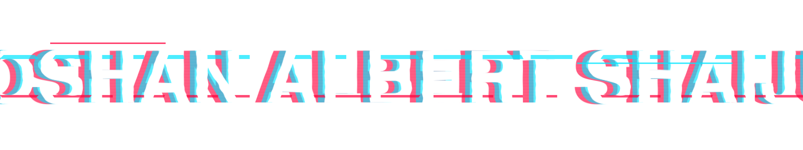

<div align="center">



<br>

### `COMPUTER SCIENCE • AI • SOFTWARE • SYSTEMS`

<br>

`BUILD`   `BREAK`   `LEARN`   `REPEAT`

<br><br>

[](https://linkedin.com/in/roshan-albert-shaiju-204584244)
[](mailto:roshanalbertsh@gmail.com)
[](https://github.com/roshanalbertshaiju)

</div>

---

# `01 / ABOUT`

Computer Science student building software around **AI, computer vision, full-stack systems and interactive experiences**.

I like taking ambitious ideas and turning them into things that actually work.

---

# `02 / SELECTED BUILDS`

### `GESTURECAD`

**Computer Vision × 3D × Interaction**

Gesture-controlled CAD interface using real-time hand tracking and 3D rendering.

`React` `TypeScript` `MediaPipe` `Three.js`

→ [VIEW REPOSITORY](https://github.com/roshanalbertshaiju/GestureCAD)

---

### `YUVA TECH-FEST`

**Full Stack × Real-World Deployment**

Event platform built for registrations, authentication, QR tickets and event infrastructure.

`React` `Firebase` `Three.js`

→ [VIEW REPOSITORY](https://github.com/roshanalbertshaiju/yuva_techfest)

---

### `ERP`

**Software Engineering × Business Systems**

Production-oriented ERP platform with authentication, role-based access and business workflows.

`Next.js` `PostgreSQL` `Supabase`

---

# `03 / CURRENTLY`

```text
AI AGENTS             ███████████████░░░   EXPLORING
COMPUTER VISION       ██████████████░░░░   BUILDING
SOFTWARE SYSTEMS      █████████████████░   BUILDING
3D INTERACTION        ███████████░░░░░░░   EXPERIMENTING
```

---

# `04 / STACK`

**LANGUAGES**

`C` `C++` `Python` `JavaScript` `TypeScript` `Dart`

**AI / ML**

`PyTorch` `TensorFlow` `Computer Vision` `AI Agents`

**WEB / APPLICATIONS**

`React` `Next.js` `Node.js` `Flask` `Flutter` `Electron`

**3D / INTERACTION**

`Three.js` `React Three Fiber`

**CLOUD / DATA**

`Supabase` `Firebase` `Azure` `Google Cloud` `Vercel`

---

# `05 / ACTIVITY`

<div align="center">


</div>

---

<div align="center">

`ROSHAN ALBERT SHAIJU`

**BUILDING THE NEXT THING.**

</div>
